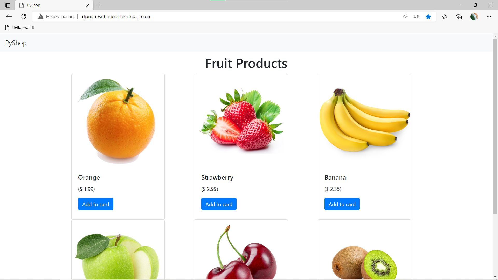

# PyShop | Simple Django website 
Sourcode and Resources for MyShop Products

# Installation
* 1 - clone repo https://github.com/uzdevpython/Products_Myshop.git
* 2 - create a virtual environment and activate
*  - pip install virtualenv
*  - virtualenv env
*  - env\scripts\activate
* 3 - cd into project "Products_Myshop"
* 4 - set your .env file with using .env_example
* 5 - pip install -r requirements.txt
* 6 - python manage.py loaddata fixture/products.json
* 7 - python manage.py runserver

# Features
* Ability to add products from the admin panel

# Completed with
* Django 
* Database Design and Models with Postgresql
* Deployment to heroku
